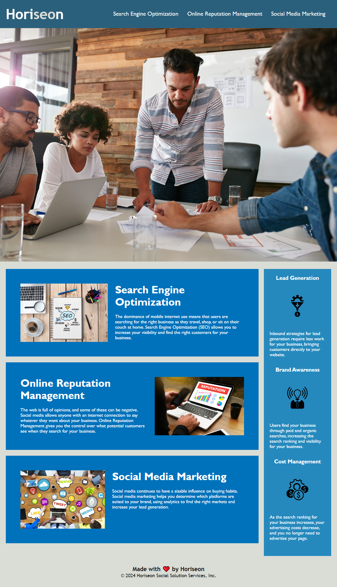

# horiseon-refactor

## Description

This Horiseon website refactor was initiated in order to meet accessibility standards and thereby improve search engine optimization.

The website required the following improvements:

- Icons and images needed accessible alt attributes
- Clear and logical semantic HTML elements
- The title elements reuired a concise and descriptive title
- A broken link needed to be fixed
- The CSS file required lots of consolidation and organization due to redundancies, unnecassary classes/ids and the introduction of semantic HTML elements
- The CSS file also required clear commenting

The website now:

- Better meets accessibility standards
- Functions correctly
- Is more efficient
- Is better set up for future development

## Installation

N/A

## Usage

The web application is a simple webpage with 3 navigation bar links to the content in the main section of the page. Simply click each link to travel to the corresponding articles.

> Deployment can be found here:
[https://simonjbr.github.io/horiseon-refactor/](https://simonjbr.github.io/horiseon-refactor/)

The following image is a screen shot of the deployed webpage:

## Credits

N/A

## License

Please refer to the LICENSE in the repo.